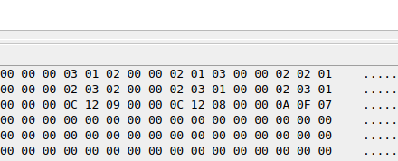

<div align="center">
  <h1>
    Relatório do Projeto: Coprocessador Aritmético Especializado em Multiplicação Matricial
  </h1>

  <h3>
    Gabriel Ribeiro Souza & Lyrton Marcell Dias Amorim & Israel Vitor Barreto de Oliveira
  </h3>

  <p>
    Engenharia de Computação – (UEFS) <br>
    Av. Transnordestina, s/n, Novo Horizonte <br>
    Feira de Santana – Bahia, Brasil – 44036-900
  </p>

  <center>gabasribeirosz@gmail.com & lymarcell@gmail.com & israelboliveir@gmail.com</center>
</div>

# 1. Introdução

<p style="text-align: justify;"> Este projeto tem como objetivo implementar operações com matrizes utilizando a FPGA DE1-SoC da Altera, programada em Verilog. Foram desenvolvidos módulos para realizar soma, subtração, multiplicação matricial, multiplicação escalar, transposição de matriz e geração da matriz oposta, todas com matrizes 5x5 de 8 bits. A seleção da operação ocorre via switches da placa, e a entrada/saída dos dados é manipulada através do In-System Memory Content Editor do Quartus. </p> <p style="text-align: justify;"> Cada operação é gerenciada por uma FSM (máquina de estados finita), que coordena a leitura das matrizes da memória RAM, ativa os módulos de operação e escreve os resultados. O projeto visa exercitar conceitos fundamentais de lógica sequencial, controle de memória, e operações aritméticas em hardware digital. </p>

<p style="text-align: justify;">
  Cada operação é gerenciada por uma FSM (máquina de estados finita), que coordena a leitura das matrizes da memória RAM, ativa os módulos de operação e escreve os resultados. O projeto visa exercitar conceitos fundamentais de lógica sequencial, controle de memória, e operações aritméticas em hardware digital.
</p>

# 2. Fundamentação Teórica

## 2.1 Máquinas de Estados Finitos (FSM) em Verilog

<p style="text-align: justify;">
  A FSM é uma modelagem matemática utilizada para projetar circuitos sequenciais digitais. Consiste em um número finito de estados, transições entre esses estados e ações associadas. Em Verilog, uma FSM é tipicamente implementada com dois blocos <code>always</code>: um para atualizar o estado atual com base no clock e outro para determinar o próximo estado e as saídas com base no estado atual e nas entradas.
</p>

## 2.2 Memória RAM de Porta Única em FPGA

<p style="text-align: justify;">
  A memória RAM de porta única permite operações de leitura e escrita, mas não simultaneamente. Durante uma operação de escrita, os dados são armazenados no endereço especificado; durante a leitura, os dados armazenados são recuperados. Em Verilog, a RAM de porta única pode ser implementada utilizando arrays de registradores, onde o acesso é controlado por sinais de habilitação de leitura/escrita e pelo clock. O próprio Quartus Prime possui em seu Catálogo uma função de Memória do Chip que realiza a criação do módulo de mapeamento e criação do bloco de Memória RAM de Porta Única com tamanho máximo de até 256 bits.
</p>

## 2.3 Multiplicação de Matrizes em Hardware

<p style="text-align: justify;">
  A multiplicação de matrizes é uma operação fundamental em diversas aplicações de processamento de sinais e imagens. Implementá-la diretamente em hardware, como em FPGAs, permite ganhos significativos de desempenho. A operação básica envolve o cálculo do produto escalar entre as linhas da primeira matriz e as colunas da segunda matriz, acumulando os resultados para formar os elementos da matriz resultante. Implementações eficientes buscam otimizar o uso de recursos e minimizar o tempo de latência.
</p>

## 3. Metodologia

### 3.1 Estrutura do Projeto

| Módulo             | Descrição                                                                 |
|--------------------|---------------------------------------------------------------------------|
| `main.v`           | Módulo principal com FSM para coordenar leitura, operação e escrita.      |
| `sum.v`            | Soma elemento a elemento das matrizes.                                    |
| `subtraction.v`    | Subtração elemento a elemento.                                            |
| `multiplication.v` | Multiplicação matricial 5x5 sequencial.                                   |
| `scalar.v`         | Multiplicação escalar por um valor fixado.                                |
| `transposed.v`     | Transposta da matriz A.                                                   |
| `opposite.v`       | Gera a matriz oposta da matriz A.                                         |
| `determinant2x2.v` | Gera a determinante 2 por 2 da matriz A.                                  |
| `determinant3x3.v` | Gera a determinante 3 por 3 da matriz A.                                  |
| `ram1port.v`       | Memória RAM de porta única para armazenar as matrizes.                    |

**Tabela 1** - Estrutura do Projeto

### 3.2 Códigos das Operações

| Código | Switch Ativado | Operação                  | Descrição                                                        |
|--------|----------------|---------------------------|----------------------------------------------------------------- |
| 0      | `SW[0] = 1`     | Soma                      | Soma elemento a elemento entre duas matrizes.                   |
| 1      | `SW[1] = 1`     | Subtração                 | Subtrai a segunda matriz da primeira.                           |
| 2      | `SW[2] = 1`     | Multiplicação Matricial   | Produto A x B.                                                  |
| 3      | `SW[3] = 1`     | Multiplicação Escalar     | Multiplica cada elemento da matriz A por um escalar de B.       |
| 4      | `SW[4] = 1`     | Transposta                | Transpõe a matriz A.                                            |
| 5      | `SW[5] = 1`     | Matriz Oposta             | Inverte o sinal de cada elemento da matriz A.                   |
| 6      | `SW[6] = 1`     | Determinante 2x2          | Realiza um cálculo da determinante de 2 por 2 da matriz A.      |
| 7      | `SW[7] = 1`     | Determinante 3x3          | Realiza um cálculo da determinante de 3 por 3 da matriz A.      |
| 15     | Nenhum          | Nenhuma                   | Nenhuma operação é executada.                                   |

**Tabela 2** - Código de Operações

**Apenas um switch deve estar ativado por vez.**

### 3.3 FSM - Máquina de Estados

| Estado | Ação                                                                 |
|--------|----------------------------------------------------------------------|
| 0      | Espera por operação válida.                                          |
| 1      | Leitura da Matriz A da RAM.                                          |
| 2      | Atualiza endereço para a matriz B.                                   |
| 3      | Leitura da Matriz B.                                                 |
| 4      | Atualiza endereço para escrita do resultado.                         |
| 5      | Executa a operação ou espera pelo sinal `done` (multiplicação).      |
| 6      | Ativa `wren` e escreve resultado na RAM.                             |
| 7      | Espera para garantir estabilidade da escrita.                        |
| 8      | Desativa `wren` e reinicia FSM.                                      |

**Tabela 3** - Máquina de Estados

A Figura 1 ilustra o fluxo de estados de uma Máquina de Estados Finitos (FSM) projetada para controlar o processo das operações matriciais. Essa FSM é responsável por coordenar a leitura dos dados de entrada, acionar o módulo de processamento correspondente (como soma, subtração ou multiplicação), e gerenciar a escrita dos resultados na memória de forma sequencial e sincronizada.

<p align="center">
  
</p>
<p align="center">
  <i>Figura 1 – Diagrama da Máquina de Estados (FSM)</i>
</p>


### 3.4 Memória RAM

| Endereço | Conteúdo         |
|----------|------------------|
| 0        | Matriz A         |
| 1        | Matriz B         |
| 2        | Resultado        |

**Tabela 4** - Memória RAM

### 3.5 Clock

Utilizou-se um divisor de clock interno para gerar um clock mais lento, garantindo estabilidade nas transições da FSM e evitando leituras incorretas.

### 3.6 Operações
Afim de tornar as operações mais fáceis de serem executadas pelo sistema, tanto a matriz A, quanto a matriz B foram sempre consideradas matrizes 5 por 5 preenchidas com zeros e sobrescritas com novos valores conforme fossem escritos no endereço correspondente da memória, onde cada endereçamento é a representação hexadecimal de um elemento de 8 bits e cada linha da matriz seriam os 40 bits e sequência do bloco de RAM da direita para a esquerda.

#### Multiplicação:
<p style="text-align: justify;">
  O módulo da multiplicação foi implementado utilizando multiplicação escalar linha a linha, onde o Clock foi dividido para 1/4 do seu valor original para sincronizar com o tempo da operação que realiza a multiplicação escalar linha a linha, lendo os 40 bits (5 elementos de 8 bits cada) e em seguida registra o valor da multiplicação em um registrador temporário para posteriormente escrever o valor final na matriz resultante que será escrita na memória após a confirmação de conclusão da operação por meio do sinal "done".
</p>

#### Demais Operações

<p style="text-align: justify;">
  Por se tratarem de operações mais simples, as demais operações não necessitaram do uso de clock por utilizarem operadores mais simples, então são imediatamente realizadas pelo sistema. Elas utilizam a função do Verilog HDL "generate" que serve para criar estruturas repetitivas de hardware. Criando várias operações independentes que são realizadas simultaneamente.

```text
genvar i;
generate
    for (i = 0; i < 25; i = i + 1) begin : matrix_sum
        assign result[i*8 +: 8] = matrix_a[i*8 +: 8] + matrix_b[i*8 +: 8];
    end
endgenerate
```

Neste caso, o compilador Verilog vai criar 25 somas independentes de 8 bits. 25 circuitos físicos de somas, todos funcionando ao mesmo tempo (paralelamente). Cada um pegando 8 bits da entrada matrix_a e matrix_b e gerando 8 bits de saída.

</p>

##### Soma e Subtração:
<p style="text-align: justify;">
  A soma é feita somando o elemento i (percorrido pelo for) da matrix_a com o elemento i da matrix_b. O resultado é colocado na posição correspondente da matriz de saída. i*8 +: 8 representa o slice de 8 bits correspondente ao elemento que está sendo percorrido no momento. No caso da subtração, ela é realizada da mesma maneira mas ao invés de utilizar o operador de soma, utiliza o operador de subtração.
</p>

##### Multiplicação Escalar:
<p style="text-align: justify;">
  O módulo scalar realiza a multiplicação escalar de uma matriz 5x5 de números de 8 bits por um único valor escalar, também de 8 bits. Para realizar essa operação de forma eficiente, o código utiliza um bloco generate com um laço for, que percorre cada posição da matriz (de 0 a 24) e gera automaticamente a lógica de multiplicação para cada elemento. Isso evita escrever a multiplicação individualmente para cada elemento da matriz e facilita a escalabilidade do projeto.
</p>

##### Oposta:
<p style="text-align: justify;">
O módulo opposite calcula a matriz oposta de uma matriz 5x5 de 8 bits, ou seja, inverte o sinal de cada elemento. A entrada matrix_a representa a matriz original, e a saída result contém os valores negativos correspondentes. O código utiliza um laço generate para aplicar a operação de inversão de sinal a cada um dos 25 elementos da matriz de forma automática e organizada. A entrada matrix_b não é utilizada nesse módulo.
</p>

##### Transposta:
<p style="text-align: justify;">
O módulo transposed calcula a transposta de uma matriz 5x5 representada como um vetor de 200 bits (25 elementos de 8 bits). Usando dois laços generate, o código reorganiza os elementos da matriz original, trocando linhas por colunas. A entrada matrix_a contém os dados da matriz original e a saída result armazena a matriz transposta. A entrada matrix_b não é utilizada neste módulo.
</p>

##### Determinante 2x2:
<p style="text-align: justify;">
O módulo determinant2x2 calcula o determinante de uma submatriz 2x2 localizada no canto superior esquerdo de uma matriz 5x5 (representada como um vetor de 200 bits). O código primeiro extrai os elementos individuais da matriz usando dois laços generate, armazenando-os em uma estrutura bidimensional. Em seguida, realiza a operação (a*d - b*c) com os elementos das posições [0][0], [0][1], [1][0] e [1][1] para obter o determinante.
</p>

##### Determinante 2x3:
<p style="text-align: justify;">
O módulo determinant3x3 calcula o determinante de uma submatriz 3x3 localizada no canto superior esquerdo de uma matriz 5x5 representada como um vetor linear de 200 bits. Utilizando laços generate, o vetor é reorganizado em uma estrutura de matriz bidimensional para facilitar o acesso aos elementos. O determinante é calculado usando a fórmula padrão para matrizes 3x3:
det = a(ei − fh) − b(di − fg) + c(dh − eg),
onde os elementos são extraídos das posições [0][0] a [2][2].
</p>

# 4. Resultados

<p style="text-align: justify;">
  Foram realizados testes no In-System Memory Content Editor inserindo valores nas posições de memória correspondentes às matrizes A e B, ativando os switches e observando os resultados no endereço de saída. O sistema demonstrou funcionamento correto para todas as operações propostas.
</p>

### Exemplo de Resultado:

#### Matriz A:
```text
[ 1  2 ]
[ 3  2 ]
```

#### Matriz B:
```text
[ 3  2 ]
[ 2  1 ]
```

#### Resultado Esperado da Soma:
```text
[4  4]
[5  5]
```

<div align="center">
  
</div>

<p align="center">
  <i>Figura 2 – Resultado da Soma de Matriz 2x2</i>
</p>

<p align="center">
  
</p>
<p align="center">
  <i>Figura 3 – Resultado da Multiplicação de Matriz 2x2</i>
</p>

<p align="center">
  
</p>
<p align="center">
  <i>Figura 4 – Resultado da Multiplicação de Matriz 3x3</i>
</p>

#### Matriz A:
```text
[ 1  2 ]
[ 3  2 ]
```

#### Resultado Esperado da Determinante:
```text
[ -4 ]
```

<div align="center">
  
</div>

<p align="center">
  <i>Figura 5 – Resultado da Determinante de Matriz 2x2</i>
</p>

No caso dessa determinante de valor negativo, o código retorna o resultado "FC" que no complemento à dois é -4.

# 5. Conclusão
<p style="text-align: justify;"> O projeto mostrou-se eficaz para o processamento aritmético de matrizes utilizando FPGA. A implementação modular e a utilização de FSMs promoveu a efetuação de todas as operações propostas com alguns vieses que deverão ser corrigidos posteriormente, como o tratamento de overflow e a utilização de instruções decodificadas para realização das operações. O uso de memória RAM para armazenamento e o controle sequencial das operações permitiram validar o sistema utilizando a ferramenta "In-System Memory Content Editor" do Quartus. </p> <p style="text-align: justify;"> A arquitetura desenvolvida permite a flexibilidade para inclusão das funcionalidades essencializadas para necessidades futuras, tal como o uso de instruções. A divisão do módulo de controle e operação permitiu o desenvolvimento incremental e a depuração durante o processo de implementação.</p> <p style="text-align: justify;"> Durante a execução do projeto, observou-se que o uso de FSMs com 9 estados foi essencial para que a multiplicação tivesse o tempo adequado para sua conclusão e proporcionou uma organização eficiente das etapas do processamento, assegurando a correta sincronização entre leitura de dados, processamento e escrita dos resultados. </p> <p style="text-align: justify;"> Como proposta de melhoria futura, pretende-se: <ul> <li>Adicionar suporte a operações com ponto flutuante;</li> <li>Substituir o controle manual via switches por um sistema baseado em instruções armazenadas em ROM, com um decodificador de instruções e controle sequencial automatizado, aproximando o sistema de uma arquitetura de processador simples;</li> </ul> </p> <p style="text-align: justify;"> Dessa forma, o projeto representa não apenas uma solução funcional para o problema proposto, mas também uma base sólida para estudos mais avançados em arquiteturas digitais, processamento de sinais e sistemas embarcados utilizando FPGAs. </p>

# 6. Referências

- KUO, Franklin P. et al. Fundamentos de Sistemas Digitais. Pearson Education do Brasil, 2015.
- [Intel – Produtos Programáveis (FPGAs)](https://www.intel.com.br/content/www/br/pt/products/programmable.html)
- [FPGA Academy – Cursos e Recursos Educacionais](https://fpgacademy.org/)
