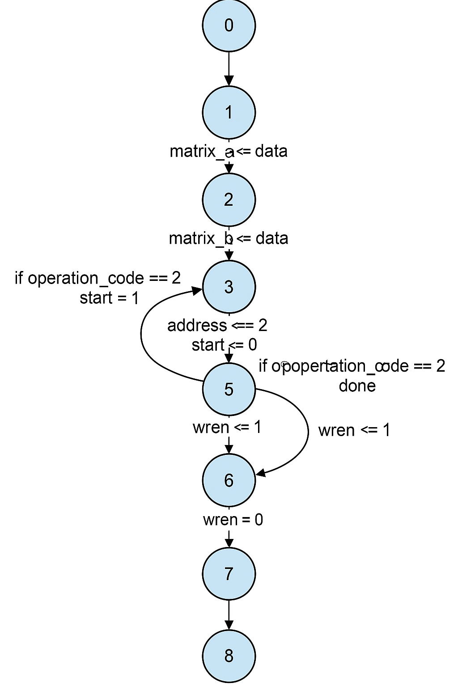
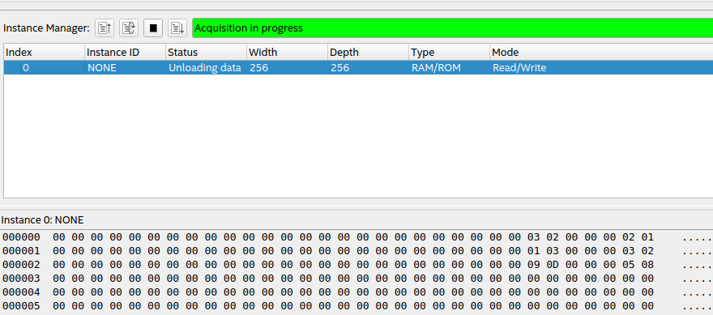

<div align="center">
  <h1>
    Relatório do Projeto: Coprocessador Aritmético Especializado em Multiplicação Matricial
  </h1>

  <h3>
    Gabriel Ribeiro Souza & Lyrton Marcell Dias Amorim & Israel Vitor Barreto de Oliveira
  </h3>

  <p>
    Engenharia de Computação – (UEFS) <br>
    Av. Transnordestina, s/n, Novo Horizonte <br>
    Feira de Santana – Bahia, Brasil – 44036-900
  </p>

  <center>gabasribeirosz@gmail.com & lymarcell@gmail.com & israelboliveir@gmail.com</center>
</div>

# 1. Introdução

<p style="text-align: justify;"> Este projeto tem como objetivo implementar operações com matrizes utilizando a FPGA DE1-SoC da Altera, programada em Verilog. Foram desenvolvidos módulos para realizar soma, subtração, multiplicação matricial, multiplicação escalar, transposição de matriz e geração da matriz oposta, todas com matrizes 5x5 de 8 bits. A seleção da operação ocorre via switches da placa, e a entrada/saída dos dados é manipulada através do In-System Memory Content Editor do Quartus. </p> <p style="text-align: justify;"> Cada operação é gerenciada por uma FSM (máquina de estados finita), que coordena a leitura das matrizes da memória RAM, ativa os módulos de operação e escreve os resultados. O projeto visa exercitar conceitos fundamentais de lógica sequencial, controle de memória, e operações aritméticas em hardware digital. </p>

<p style="text-align: justify;">
  Cada operação é gerenciada por uma FSM (máquina de estados finita), que coordena a leitura das matrizes da memória RAM, ativa os módulos de operação e escreve os resultados. O projeto visa exercitar conceitos fundamentais de lógica sequencial, controle de memória, e operações aritméticas em hardware digital.
</p>

# 2. Fundamentação Teórica

## 2.1 Multiplicação de Matrizes em Hardware

<p style="text-align: justify;">
  A multiplicação de matrizes é uma operação fundamental em diversas aplicações de processamento de sinais e imagens. Implementá-la diretamente em hardware, como em FPGAs, permite ganhos significativos de desempenho. A operação básica envolve o cálculo do produto escalar entre as linhas da primeira matriz e as colunas da segunda matriz, acumulando os resultados para formar os elementos da matriz resultante. Implementações eficientes buscam otimizar o uso de recursos e minimizar o tempo de latência.
</p>

## 2.2 Máquinas de Estados Finitos (FSM) em Verilog

<p style="text-align: justify;">
  A FSM é uma modelagem matemática utilizada para projetar circuitos sequenciais digitais. Consiste em um número finito de estados, transições entre esses estados e ações associadas. Em Verilog, uma FSM é tipicamente implementada com dois blocos <code>always</code>: um para atualizar o estado atual com base no clock e outro para determinar o próximo estado e as saídas com base no estado atual e nas entradas.
</p>

## 2.3 Memória RAM de Porta Única em FPGA

<p style="text-align: justify;">
  A memória RAM de porta única permite operações de leitura e escrita, mas não simultaneamente. Durante uma operação de escrita, os dados são armazenados no endereço especificado; durante a leitura, os dados armazenados são recuperados. Em Verilog, a RAM de porta única pode ser implementada utilizando arrays de registradores, onde o acesso é controlado por sinais de habilitação de leitura/escrita e pelo clock.
</p>

## 3. Metodologia

### 3.1 Estrutura do Projeto

| Módulo             | Descrição                                                                 |
|--------------------|---------------------------------------------------------------------------|
| `main.v`           | Módulo principal com FSM para coordenar leitura, operação e escrita.      |
| `sum.v`            | Soma elemento a elemento das matrizes.                                    |
| `subtraction.v`    | Subtração elemento a elemento.                                            |
| `multiplication.v` | Multiplicação matricial 5x5 sequencial.                                   |
| `scalar.v`         | Multiplicação escalar por um valor fixado.                                |
| `transposed.v`     | Transposta da matriz A.                                                   |
| `opposite.v`       | Gera a matriz oposta da matriz A.                                         |
| `ram1port.v`       | Memória RAM de porta única para armazenar as matrizes.                    |

### 3.2 Códigos das Operações

| Código | Switch Ativado | Operação                  | Descrição                                                       |
|--------|----------------|---------------------------|-----------------------------------------------------------------|
| 0      | `SW[0] = 1`     | Soma                      | Soma elemento a elemento entre duas matrizes.                   |
| 1      | `SW[1] = 1`     | Subtração                 | Subtrai a segunda matriz da primeira.                           |
| 2      | `SW[2] = 1`     | Multiplicação Matricial   | Produto A x B.                                                  |
| 3      | `SW[3] = 1`     | Multiplicação Escalar     | Multiplica cada elemento da matriz A por um escalar de B.      |
| 4      | `SW[4] = 1`     | Transposta                | Transpõe a matriz A.                                            |
| 5      | `SW[5] = 1`     | Matriz Oposta             | Inverte o sinal de cada elemento da matriz A.                   |
| 15     | Nenhum          | Nenhuma                   | Nenhuma operação é executada.                                   |

⚠️ **Apenas um switch deve estar ativado por vez.**

### 3.3 FSM - Máquina de Estados

| Estado | Ação                                                                 |
|--------|----------------------------------------------------------------------|
| 0      | Espera por operação válida.                                          |
| 1      | Leitura da Matriz A da RAM.                                          |
| 2      | Atualiza endereço para a matriz B.                                   |
| 3      | Leitura da Matriz B.                                                 |
| 4      | Atualiza endereço para escrita do resultado.                         |
| 5      | Executa a operação ou espera pelo sinal `done` (multiplicação).      |
| 6      | Ativa `wren` e escreve resultado na RAM.                             |
| 7      | Espera para garantir estabilidade da escrita.                        |
| 8      | Desativa `wren` e reinicia FSM.                                      |

<p align="center">
  
</p>
<p align="center">
  <i>Figura 1 – Diagrama da Máquina de Estados (FSM)</i>
</p>


### 3.4 Memória RAM

| Endereço | Conteúdo         |
|----------|------------------|
| 0        | Matriz A         |
| 1        | Matriz B         |
| 2        | Resultado        |

### 3.5 Clock

Utilizou-se um divisor de clock interno para gerar um clock mais lento, garantindo estabilidade nas transições da FSM e evitando leituras incorretas.

# 4. Resultados

<p style="text-align: justify;">
  Foram realizados testes no In-System Memory Content Editor inserindo valores nas posições de memória correspondentes às matrizes A e B, ativando os switches e observando os resultados no endereço de saída. O sistema demonstrou funcionamento correto para todas as operações propostas.
</p>

### Exemplo de Resultado:

#### Matriz A:
```text
[ 1  2  3  4  5 ]
[ 6  7  8  9 10 ]
[11 12 13 14 15 ]
[16 17 18 19 20 ]
[21 22 23 24 25 ]
```

#### Matriz B:
```text
[ 5  4  3  2  1 ]
[10  9  8  7  6 ]
[15 14 13 12 11 ]
[20 19 18 17 16 ]
[25 24 23 22 21 ]
```

#### Resultado Esperado da Soma:
```text
[ 6  6  6  6  6 ]
[16 16 16 16 16 ]
[26 26 26 26 26 ]
[36 36 36 36 36 ]
[46 46 46 46 46 ]
```
<p align="center">
  
</p>
<p align="center">
  <i>Figura 2 – Resultados</i>
</p>


# 5. Conclusão
<p style="text-align: justify;"> O projeto mostrou-se eficaz para o processamento aritmético de matrizes utilizando FPGA. A implementação modular e a utilização de FSMs facilitaram a escalabilidade e manutenção do projeto. O uso de memória RAM para armazenamento e o controle sequencial das operações permitiram validar o sistema de forma prática com auxílio da ferramenta In-System Memory Content Editor do Quartus. </p> <p style="text-align: justify;"> A arquitetura desenvolvida demonstrou não apenas viabilidade técnica, mas também flexibilidade para inclusão de novas funcionalidades. A divisão clara entre os módulos de controle e operação facilitou o desenvolvimento incremental e a depuração durante o processo de implementação.</p> <p style="text-align: justify;"> Durante a execução do projeto, observou-se que o uso de FSMs proporcionou uma organização eficiente das etapas do processamento, assegurando a correta sincronização entre leitura de dados, processamento e escrita dos resultados. A aplicação prática em hardware permitiu avaliar em tempo real o funcionamento das operações, evidenciando a confiabilidade da abordagem adotada. </p> <p style="text-align: justify;"> Como proposta de melhoria futura, pretende-se: <ul> <li>Adicionar suporte a operações com ponto flutuante;</li> <li>Incluir uma interface de visualização com display ou comunicação serial com computador;</li> <li>Substituir o controle manual via switches por um sistema baseado em instruções armazenadas em ROM, com um decodificador de instruções e controle sequencial automatizado, aproximando o sistema de uma arquitetura de processador simples;</li> </ul> </p> <p style="text-align: justify;"> Dessa forma, o projeto representa não apenas uma solução funcional para o problema proposto, mas também uma base sólida para estudos mais avançados em arquiteturas digitais, processamento de sinais e sistemas embarcados utilizando FPGAs. </p>

# 6. Referências

- KUO, Franklin P. et al. Fundamentos de Sistemas Digitais. Pearson Education do Brasil, 2015.
- [Intel – Produtos Programáveis (FPGAs)](https://www.intel.com.br/content/www/br/pt/products/programmable.html)
- [FPGA Academy – Cursos e Recursos Educacionais](https://fpgacademy.org/)
